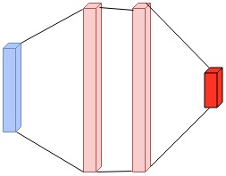

# Atari - Deep Reinforcement Learning algorithms in TensorFlow

Learning to play Atari in TensorFlow using Deep Reinforcement Learning.
This repository is based on code from GitHub user brendanator, and the original code can be found [here](https://github.com/brendanator/atari-rl).

## RAM input variation

While the original code only ran on pixel frame input, we altered it to run on RAM input.
The RAM for Atari games is a vector of 128 integers, each representing a byte.
This RAM vector is normalized by dividing by 256 before feeding it to the network.

Let $$|A|$$ represent the number of possible actions for the game being trained on.

The RAM-input networks to have the following architectures:

- Single stream architecture
    - Input: Normalized RAM vector of length 128
    - 2 fully connected layers of 256 neurons each

    - Fully connected layer of $$|A|$$ neurons



- Dueling architecture
    - Input: Normalized RAM vector of length 128
    - This input is split into two streams: Stream1 and Stream2
    - Stream1
        - 2 fully connected layers of 256 neurons each

        - A single neuron - represents state value
    - Stream2
        - 2 fully connected layers of 256 neurons each

        - Fully connected layer of $$|A|$$ neurons.
    - Stream1 and Stream2 are then combined according to the following equation: $$ Q(s,a;\theta, \alpha, \beta) = V(s;\theta,\beta) + \left( A(s,a;\theta,\alpha) - \frac{1}{|\mathcal{A}|} \sum_{a'} A(s,a';\theta,\alpha)\right)$$


## Setup
```
git clone https://github.com/andyrdt/atari-rl
git checkout ram_input
git submodule update --init
conda create --name atari-rl python=2.7
source activate atari-rl
conda install -y -c https://conda.binstar.org/menpo opencv3
conda install -y h5py numpy
pip install tensorflow
pip install 'gym[atari]'
```

## Usage

- Show all options - `python main.py --help`
- Play a specific [Atari game](https://github.com/mgbellemare/Arcade-Learning-Environment/blob/master/src/games/Roms.cpp#L17) - `python main.py --game Breakout`

- To train an agent on SpaceInvaders and RAM input with double_q learning for 10 million steps, run the following:
    - `python main.py --game SpaceInvaders --double_q --num_steps 10000000`
- To then evaluate this agent with an epsilon of 0.05, run the following command:
    - `python main.py --game SpaceInvaders --double_q --initial_exploration 0.05 --final_exploration 0.05 --train_period 200000000`

- To train an agent on SpaceInvaders and RAM input with double_q learning and a **dueling architecture** for 10 million steps, run the following:

    - `python main.py --game SpaceInvaders --double_q --num_steps 10000000`
- To then evaluate this agent with an epsilon of 0.05, run the following command:
    - `python main.py --game SpaceInvaders --double_q --initial_exploration 0.05 --final_exploration 0.05 --train_period 200000000`

## Acknowledgements

- https://github.com/brendanator/atari-rl
- https://github.com/mgbellemare/SkipCTS - Used in implementation of [Unifying Count-Based Exploration and Intrinsic Motivation](https://arxiv.org/pdf/1606.01868.pdf)
- https://github.com/Kaixhin/Atari
- https://github.com/carpedm20/deep-rl-tensorflow
